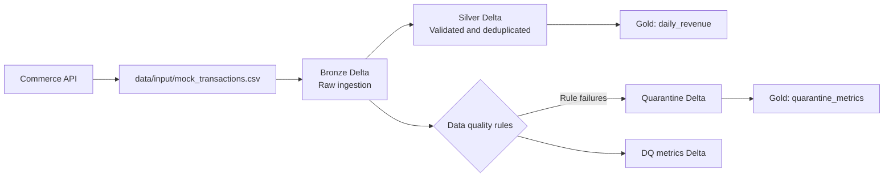

# Data Quality PySpark POC

A local PySpark and Delta Lake proof of concept for ingesting e-commerce transactions, applying data-quality rules, and building reporting tables that can be adapted for Databricks.

PySpark requires a Java runtime. Java 17 is a suitable LTS choice for this project.

## Data Flow



The included generator simulates the API source locally. In a Databricks deployment, the input step can be replaced with an API connector or ingestion job.

## Layers

- **Bronze**: Reads the mock CSV with an explicit schema and adds `_bronze_insert_ts`.
- **Silver**: Quarantines invalid records with failure reasons, removes exact duplicates, logs per-rule DQ counts, and adds `_silver_processed_ts`.
- **Gold**: Produces daily revenue and quarantine metrics for reporting.

## Data Quality Rules

- `transaction_id` must not be null.
- `transaction_amount` must be greater than zero.
- `transaction_date` must not be in the future.
- Exact duplicate rows are removed from the clean Silver output.

DQ metrics are written to `data/dq_metrics` with one row per rule and a `_dq_logged_ts` timestamp. A record that fails multiple rules is counted once for each applicable rule.

## Project Structure

```text
.
├── data/
│   ├── input/          # Generated local CSV input; ignored by Git
│   ├── bronze/         # Bronze Delta output; ignored by Git
│   ├── silver/         # Silver Delta output; ignored by Git
│   ├── gold/           # Gold Delta outputs; ignored by Git
│   ├── quarantine/     # Invalid records; ignored by Git
│   └── dq_metrics/     # Per-rule DQ counts; ignored by Git
├── src/
│   ├── config.py
│   ├── generate_mock_data.py
│   ├── bronze_ingestion.py
│   ├── silver_dq_processing.py
│   └── gold_aggregation.py
├── tests/
└── requirements.txt
```

## Setup

On macOS with Homebrew:

```bash
brew install openjdk@17
export JAVA_HOME="$(brew --prefix openjdk@17)/libexec/openjdk.jdk/Contents/Home"
export PATH="$JAVA_HOME/bin:$PATH"
java -version
```

Add the two `export` lines to `~/.zshrc` if you want them to persist across terminal sessions.

```bash
python3 -m venv .venv
source .venv/bin/activate
pip install -r requirements.txt
```

## Run the Pipeline

The recommended wrapper commands are:

```bash
make setup
make pipeline
```

Because Bronze uses append mode, `make pipeline` stops if Bronze data already exists. To intentionally clear generated local data and rerun everything:

```bash
make pipeline-reset
```

Individual stages are also available:

```bash
make generate
make bronze
make silver
make gold
```

The generated input contains 2,000 transactions with deliberate null IDs, negative amounts, duplicate rows, and future dates for testing.

## Run Tests

```bash
make test
```

The wrappers automatically use `.venv` and detect the Homebrew OpenJDK 17 installation on macOS. The underlying Python modules can still be run directly with `python3 -m src.<module>` when needed.

Each wrapper prints a highlighted start banner, completion status, and record-count summary. Set `NO_COLOR=1` to disable ANSI colors. Spark routine logs are reduced to `ERROR`; failures are still shown.

## Databricks Runner

The Databricks flow is intended for a Databricks notebook attached to Serverless or Dedicated compute. The configuration reuses Databricks' existing `spark` session and does not access `SparkContext`, so Serverless compute is supported.

### 1. Sync the Repository

Pull or sync the latest repository contents into the Databricks workspace. Restart the notebook Python process after changing the repository or environment configuration:

```python
%restart_python
```

### 2. Upload the Input File

Upload `mock_transactions.csv` to the `input/` directory of a Unity Catalog Volume. For example:

```text
/Volumes/workspace/default/test-poc-volume/input/mock_transactions.csv
```

The Volume root is `/Volumes/workspace/default/test-poc-volume`, not the `input/` directory itself.

### 3. Configure the Volume Root

Set `DATABRICKS_DATA_DIR` before importing any `src` modules:

```python
import os

os.environ["DATABRICKS_DATA_DIR"] = "/Volumes/workspace/default/test-poc-volume"
```

Do not replace `DATABRICKS_DATA_DIR_ENV` in `src/config.py` with the Volume path. It must remain the environment variable name:

```python
DATABRICKS_DATA_DIR_ENV = "DATABRICKS_DATA_DIR"
```

### 4. Run the Pipeline

Import the modules only after setting the environment variable:

```python
%load_ext autoreload
%autoreload 2

from src import bronze_ingestion, gold_aggregation, silver_dq_processing

print("Starting Bronze Layer Ingestion...")
bronze_ingestion.run()

print("Starting Silver Layer DQ Processing...")
silver_dq_processing.run()

print("Starting Gold Layer Aggregation...")
gold_aggregation.run()

print("Pipeline Execution Complete.")
```

The Databricks runner intentionally skips `generate_mock_data`; Bronze reads the uploaded file from `<volume>/input/`. The resulting Delta paths are:

```text
<volume>/bronze
<volume>/silver
<volume>/quarantine
<volume>/dq_metrics
<volume>/gold
```

The local `make pipeline` workflow and `generate_mock_data` script remain available for local development. Do not run the local generator in the Databricks notebook.

### 5. Verify Configuration

If imports fail, restart Python and run this check before importing the pipeline modules:

```python
import os

print(os.environ.get("DATABRICKS_DATA_DIR"))
```

It should print the Volume root, for example `/Volumes/workspace/default/test-poc-volume`.
