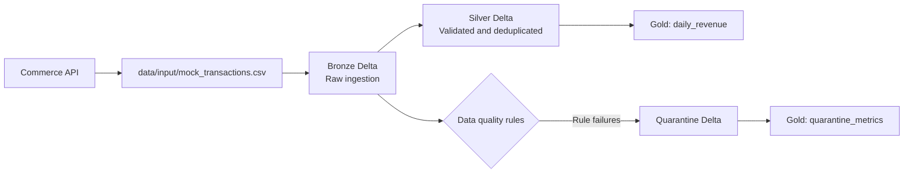

# Data Quality PySpark POC

A local PySpark and Delta Lake proof of concept for ingesting e-commerce transactions, applying data-quality rules, and building reporting tables that can be adapted for Databricks.

## Data Flow



The included generator simulates the API source locally. In a Databricks deployment, the input step can be replaced with an API connector or ingestion job.

## Layers

- **Bronze**: Reads the mock CSV with an explicit schema and adds `_bronze_insert_ts`.
- **Silver**: Quarantines invalid records, removes exact duplicates, and adds `_silver_processed_ts`.
- **Gold**: Produces daily revenue and quarantine metrics for reporting.

## Data Quality Rules

- `transaction_id` must not be null.
- `transaction_amount` must be greater than zero.
- `transaction_date` must not be in the future.
- Exact duplicate rows are removed from the clean Silver output.

## Project Structure

```text
.
├── data/
│   ├── input/          # Generated local CSV input; ignored by Git
│   ├── bronze/         # Bronze Delta output; ignored by Git
│   ├── silver/         # Silver Delta output; ignored by Git
│   ├── gold/           # Gold Delta outputs; ignored by Git
│   └── quarantine/     # Invalid records; ignored by Git
├── src/
│   ├── config.py
│   ├── generate_mock_data.py
│   ├── bronze_ingestion.py
│   ├── silver_dq_processing.py
│   └── gold_aggregation.py
├── tests/
└── requirements.txt
```

## Setup

```bash
python3 -m venv .venv
source .venv/bin/activate
pip install -r requirements.txt
```

## Run the Pipeline

Run the stages from the repository root:

```bash
python3 src/generate_mock_data.py
python3 src/bronze_ingestion.py
python3 src/silver_dq_processing.py
python3 src/gold_aggregation.py
```

The generated input contains 2,000 transactions with deliberate null IDs, negative amounts, duplicate rows, and future dates for testing.

## Run Tests

```bash
pytest
```
